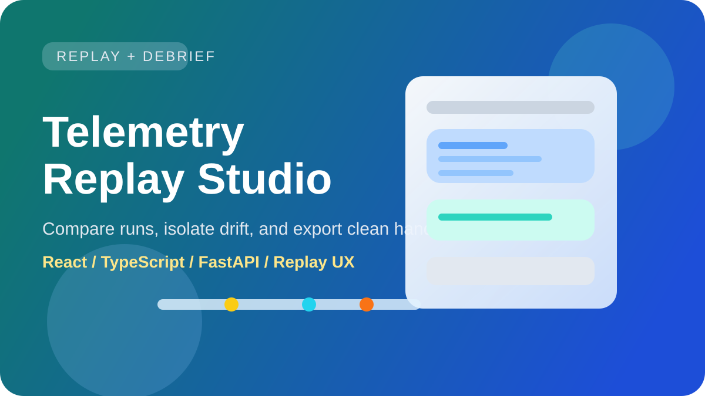
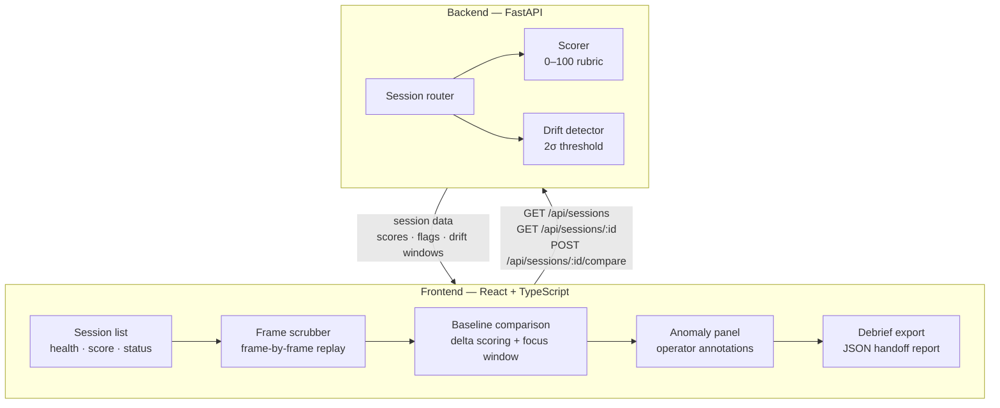

# Telemetry Replay Studio

[](https://github.com/RedBeret/telemetry-replay-studio/actions/workflows/ci.yml)



Post-run analysis workspace for edge and autonomy teams. A run finishes, you open the debrief, you need to know what happened and why, and you need to hand the result off cleanly.

This is distinct from `edge-lab-console`. Edge-lab-console handles run configuration and execution. Telemetry Replay Studio handles what comes after: replay, drift detection, scoring, and team-ready handoff summaries.

## Quick Start

```bash
# Windows
run.bat

# Linux / macOS
bash start.sh
```

Backend: http://127.0.0.1:8010  
Frontend: http://localhost:5173

## Architecture



The scorer runs server-side on every session fetch and comparison request. Drift detection compares frame-level metrics against the baseline session using a 2-standard-deviation threshold. Operator annotations are weighted in the final score — they can push a borderline session lower even when automatic metrics are nominal.

## What You Do Here

- Load a replay session and scrub through it frame by frame
- See where behavior diverged from a baseline
- Get a score that tells you at a glance whether the run is clean, degraded, or anomalous
- Flag anomalies and artifacts during review
- Export a debrief summary that a teammate can read without having the session open

## Scoring Rubric

Scores are 0–100.

| Score | Meaning |
|-------|---------|
| 90–100 | Within tolerance. Minor deviations only. Safe to proceed. |
| 70–89  | Minor degradation. Review flagged events before handoff. |
| 50–69  | Meaningful drift detected. Events require explanation before proceed. |
| 30–49  | Significant anomalies. Run likely needs a retry. |
| 0–29   | Critical failure. Do not proceed until root cause is identified and resolved. |

What gets flagged automatically: metrics exceeding baseline by more than 2σ, missing telemetry frames (gaps), out-of-order event sequencing, and any operator-annotated anomaly.

## Comparison Workflow

Select a baseline session, then run a comparison against the current session.

Baseline run, nominal:

```
Score: 94
Health: NOMINAL
Flags: 0
Top events: [steer_correction @ 14.2s, sensor_fusion_recovery @ 31.7s]
```

Current run, same config, later date:

```
Score: 61
Health: DEGRADED
Delta: -33 points

Flags:
  - sensor_lag @ 9.1s (exceeded 2sigma threshold)
  - gap_detected @ 22.4s (missing telemetry frame)
  - steer_overshoot @ 47.2s (out-of-sequence)

Top drift window: 18.0s - 35.0s
Root cause suspect: sensor fusion pipeline on reinitialization
```

## Case Study: Catching a Sensor Fusion Regression Before Handoff

**Situation.** A run completed with no immediate alarms. The operator opened the debrief to generate the handoff summary and ran a baseline comparison against the last known-good session from the same config.

**What the comparison showed.** Score dropped from 94 to 61 — a 33-point delta. The drift detector flagged a 17-second window between 18s and 35s where three events clustered: sensor lag at 9.1s exceeding the 2σ threshold, a missing telemetry frame at 22.4s, and an out-of-sequence steer overshoot at 47.2s. The scorer weighted the missing frame heavily because gaps in telemetry are a data integrity issue regardless of what the adjacent frames show.

**What the operator did.** The operator added an annotation: sensor fusion pipeline likely reinitializing on the second pass through that corridor. That annotation pushed the score from 61 to 58 and moved the session status from DEGRADED to REQUIRES EXPLANATION. The debrief export included the comparison delta, the flagged window, and the annotation text.

**Why the score matters at handoff.** Without the comparison, the run looked clean — no hard alarms, nominal completion status. The 33-point delta was only visible against the baseline. The next team receives a debrief with the score, the root cause suspect, and the operator's annotation — enough context to decide whether to retry, investigate further, or proceed with a note in the record.

All session data in this example is synthetic.

## Features

- Session list with health, score, and status filters
- Frame-by-frame replay scrubber with signal snapshots
- Timeline view with highlighted event windows
- Baseline comparison with delta scoring and focus area isolation
- Debrief export: JSON handoff report with scores, flags, and annotations
- Anomaly panel, artifact panel, and operator notes per session

## Local Development

**Backend**

```bash
cd backend
python -m venv .venv
.venv\Scripts\activate        # Windows
source .venv/bin/activate     # Linux / macOS
pip install -r requirements.txt
uvicorn app.main:app --reload --port 8010
```

**Frontend**

```bash
cd frontend
npm install
npm run dev
```

## Verification

```bash
cd backend && python -m unittest discover -s tests -v
cd backend && python -m compileall app
cd frontend && npm run build
```

## Requirements

- Python 3.12+
- Node 22+
- npm

## License

MIT. See `LICENSE`.
